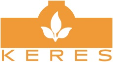

# KERES

 

The KERES-Ontology is being developed in the project KERES. Built upon the [HERACLES-Ontology](https://github.com/FraunhoferIOSB/HERACLES/), it formally describes the domains required to foster crisis management and cultural heritage protection against the threats of clime change.

### Contact

For further information, please contact Tobias Hellmund ([mail](mailto:tobias.hellmund@iosb.fraunhofer.de), [Research Gate](https://www.researchgate.net/profile/Tobias_Hellmund)) or Jürgen Moßgraber ([mail](mailto:juergen.mossgraber@iosb.fraunhofer.de), [Research Gate](https://www.researchgate.net/profile/Juergen_Mossgraber)).

### Authors

This ontology is being  developed by Tobias Hellmund, Jürgen Moßgraber and Jürgen Reuter. Since it is an artefact under development, changes might occur.

### License

Content on this site is licensed under MIT License.

